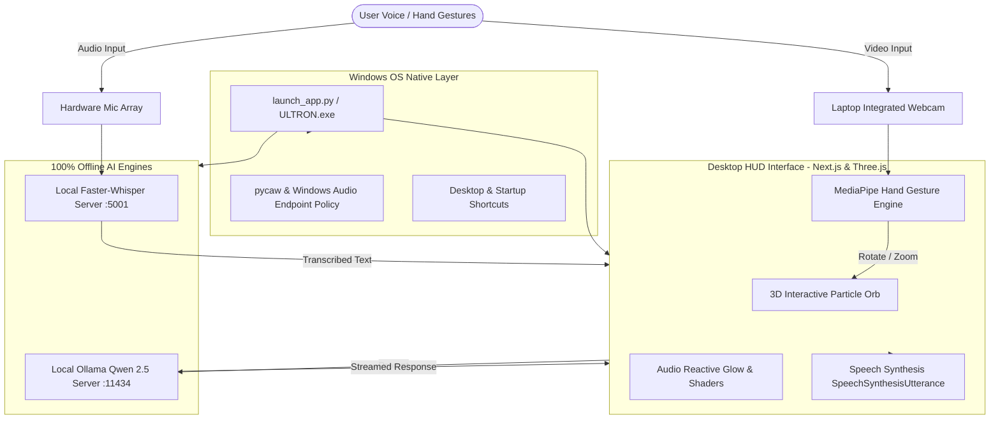

# ULTRON — End-to-End System Documentation & Capabilities Guide

> **Architecture Status**: 100% Offline, Local & Zero-Cost  
> **Repository**: [https://github.com/ashish7802/ultron](https://github.com/ashish7802/ultron)  
> **Author & Maintainer**: Ashish  

---

## 1. Executive Summary

**ULTRON** is an Iron Man-inspired futuristic desktop companion and holographic HUD assistant. It combines a 3D Three.js particle orb, MediaPipe hand tracking, completely offline voice recognition (faster-whisper), local LLM intelligence (Ollama Qwen 2.5), and Windows native hardware controls into a unified executable app without requiring any cloud API subscriptions or external tokens.

---

## 2. End-to-End System Architecture



---

## 3. What We Built & Fixed (Changelog & Key Milestones)

### A. Windows Desktop App Transformation
- **Self-Contained Launcher (`launch_app.py`)**: Built a multi-process supervisor that automatically handles warm-up of Ollama, startup of the local Whisper transcription service, launch of the Next.js frontend, and embeds everything into a sleek desktop window.
- **Auto-Startup on Windows Login**: Configured shortcuts in `%APPDATA%\Microsoft\Windows\Start Menu\Programs\Startup\ULTRON.lnk` so ULTRON wakes up automatically when the PC turns on.
- **Desktop Shortcut**: Created high-priority Desktop shortcut (`C:\Users\Ashish\Desktop\ULTRON.lnk`).

### B. Holographic Arc-Reactor Custom Branding
- Generated a high-resolution, sci-fi metallic arc-reactor logo (`ultron_logo.ico`).
- Converted into multi-layer Windows `.ico` icons and web favicons.
- Assigned the logo to desktop shortcuts, startup items, and the browser/HUD metadata.

### C. Physical Hardware Microphone Fix
- **Root Cause**: Windows had defaulted to a dead virtual audio device (`Voice Changer Virtual Audio Device`), while the physical microphone (`Intel Smart Sound Technology / Realtek`) was muted at the system level.
- **Fix**: Created PowerShell and C# CoreAudio scripts (`set_default_mic.ps1`, `unmute_all_mics.py`, `ensure_mic.py`) to permanently select the real microphone across console, multimedia, and communications endpoints, and unmute it on every app launch.

### D. Laptop Webcam Lock & Phone Request Elimination
- **Root Cause**: When pressing `G` (gesture mode), the browser asked Windows for a generic video stream. Windows routed this to `Windows Virtual Camera Device` (Phone Link), causing continuous push notifications to the user's phone.
- **Fix in `lib/handTracker.ts`**: Implemented intelligent camera enumeration that specifically unlocks device labels, blacklists virtual/phone drivers (`camo`, `droid`, `phone`, `link`, `virtual`), and locks directly onto the internal hardware camera (`HP HD Camera`).

### E. Security & Stability Engineering
- **Application Control Policy (WinError 4551)**: Handled Windows Defender Application Control blocks by providing seamless fallback from standalone binaries to local Python execution.
- **React Hydration Mismatch**: Eliminated Next.js hydration errors triggered by browser extensions (`bis_skin_checked`) by isolating client HUD components with `dynamic(..., { ssr: false })`.

---

## 4. Current App Capabilities (What ULTRON Can Do Right Now)

| Feature | Description | Trigger / How to Use |
| :--- | :--- | :--- |
| **3D Holographic Orb HUD** | Interactive 3D particle sphere responding to speech, mouse drag, and audio frequencies. | Default view on launch |
| **Always-Listening Voice AI** | Conversational loop with local speech recognition and natural voice reply. | Speak into the laptop mic |
| **Iron Man Hand Tracking** | Real-time computer vision using MediaPipe hand landmark detection. | Press **`G`** on keyboard |
| **Gesture: Rotate Orb** | Pinch thumb + index finger of one hand and drag in 3D space to rotate the core. | Pinch & Drag (Single hand) |
| **Gesture: Zoom Core** | Pinch with both hands and expand or contract distance between hands. | Two-Hand Pinch & Spread |
| **Voice Command Reset** | Say *"Ultron restart"*, *"Ultron reset"*, or *"Ultron clear"* to reset chat memory. | Voice command |
| **Keyboard Command Console** | Quick manual text prompt submission when you don't wish to speak aloud. | Press **`/`** or **`T`** |
| **HUD Mode Toggle** | Minimize HUD widgets to focus solely on the 3D core energy sphere. | Press **`H`** |
| **Local LLM Intelligence** | Powered by Qwen 2.5 (Ollama) running locally on your hardware with 0 API cost. | Automatic on question |
| **Offline Speech-to-Text** | Whisper Tiny model running locally on CPU/GPU with high accuracy. | Automatic during speech |

---

## 5. Keyboard Shortcuts Cheatsheet

- **`G`** — Toggle Camera Gesture Controls (Hand tracking On / Off)
- **`/`** or **`T`** — Open Text Command Prompt
- **`H`** — Toggle HUD Interface visibility
- **`ESC`** — Close text overlay or gesture preview
- **`Mouse Drag`** — Manually rotate the 3D Orb in space
- **`Mouse Scroll`** — Zoom camera in and out of the core

---

## 6. Directory Structure & Key Files

```text
spiderman/
├── app/
│   ├── api/chat/route.ts        # Ollama LLM integration endpoint
│   ├── api/transcribe/route.ts  # Faster-whisper proxy endpoint
│   ├── layout.tsx               # App layout with custom arc reactor icons
│   └── page.tsx                 # Client-side dynamic entry point
├── components/
│   └── JarvisOrb.tsx            # Main Three.js holographic engine & HUD
├── lib/
│   └── handTracker.ts           # MediaPipe hand gesture tracker & camera filter
├── installer/                   # Inno Setup packaging scripts
├── launch_app.py                # Master Windows desktop launcher
├── stt_server.py                # Local offline Faster-Whisper service
├── ensure_mic.py                # Audio hardware auto-configurator
├── set_default_mic.ps1          # Windows CoreAudio policy switcher
├── ultron_logo.ico              # Multi-resolution desktop app icon
└── package.json                 # Next.js and frontend dependency manifest
```

---

## 7. How to Launch and Maintain

1. **One-Click Launch**: Double-click the **ULTRON** shortcut on your Desktop (`C:\Users\Ashish\Desktop\ULTRON.lnk`).
2. **Terminal Dev Launch** (if modifying code):
   ```powershell
   python launch_app.py
   ```
3. **Git Version Control**:
   All changes are committed and pushed to the official repository:
   ```powershell
   git pull origin main
   ```
