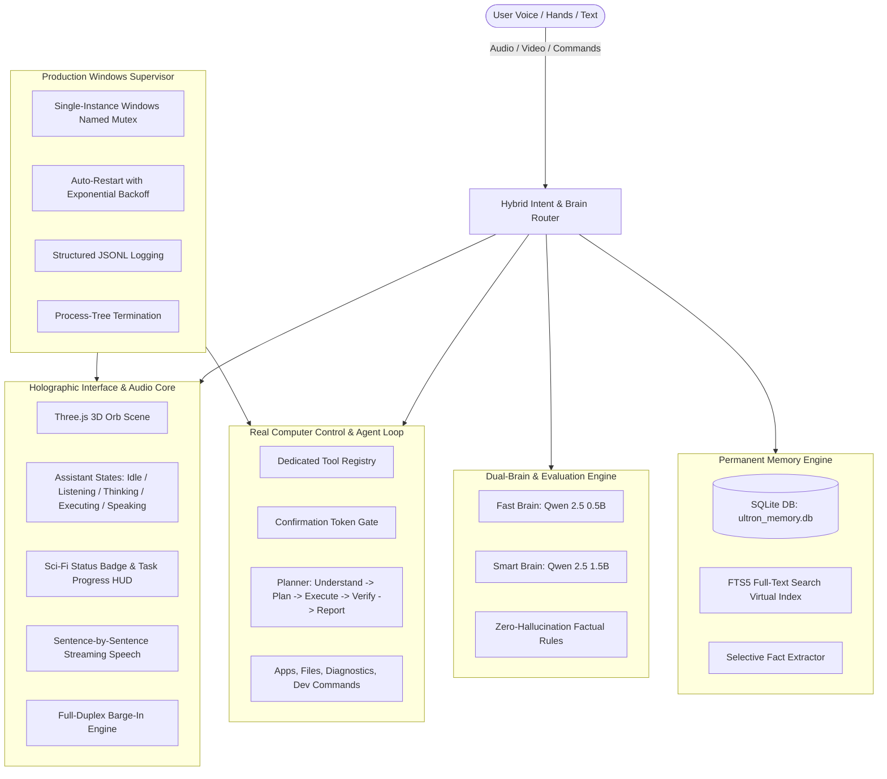

# ULTRON — End-to-End System Documentation & Capabilities Guide

> **Architecture Status**: 100% Offline, Local, Permanent Memory & Autonomous Computer Control  
> **Repository**: [https://github.com/ashish7802/ultron](https://github.com/ashish7802/ultron)  
> **Author & Maintainer**: Ashish  

---

## 1. Executive Summary

**ULTRON** is a futuristic desktop companion, holographic HUD assistant, and autonomous local agent. It combines:
1. **Intelligent Three.js Holographic Interface**: 3D particle orb reacting to real assistant states (`idle`, `listening`, `thinking`, `executing`, `speaking`, `error`, `gesture`).
2. **Dual-Brain Hybrid Routing & Anti-Hallucination**: 0ms local kernel + fast chat brain (`qwen2.5:0.5b`) + deep reasoning smart brain (`qwen2.5:1.5b`) with zero-hallucination factual guardrails.
3. **Permanent SQLite Memory**: Long-term fact preservation, user preference tracking, and semantic full-text search with SQLite FTS5.
4. **Real Computer Control & Tool Registry**: Windows application launcher/closer, file search & IO, real-time hardware telemetry (`psutil`), and developer workflows with security confirmation gates.
5. **Natural Full-Duplex Voice**: Noise-resistant VAD, instant barge-in interruption, acoustic echo cancellation, and sentence-by-sentence streaming TTS.
6. **Controlled Autonomous Agent Loop**: `Understand` $\rightarrow$ `Plan` $\rightarrow$ `Execute` $\rightarrow$ `Verify` $\rightarrow$ `Report`.
7. **Production Windows Supervisor**: Single-instance Named Mutex, health monitoring with auto-restart exponential backoff, structured JSONL logs, and clean process tree termination.

---

## 2. End-to-End System Architecture



---

## 3. The 7 Core Architectural Pillars

### Pillar 01: Smart Brain, Routing & Anti-Hallucination
- **Hardware-Aware Tiering**: Benchmarked on 8 GB RAM & Intel i5-8365U. Fast queries execute on `0.5B` (< 300ms), while complex reasoning, math, and code are routed to `1.5B` (30+ tokens/sec).
- **Deterministic 0ms Kernel**: Clock, calendar, identity, and system telemetry run directly in local rules with 0ms latency and 0% hallucination.
- **Evaluation Suite**: 100% accuracy verified on routing, tool-calling schema, and cognitive reflection traps (e.g. Bat & Ball, 5th Law of Thermodynamics, Vibranium).

### Pillar 02: Permanent Memory System (`ultron_memory.py`)
- **Database**: SQLite database located at `%LOCALAPPDATA%\ULTRON\memory\ultron_memory.db`.
- **Tables**:
  - `user_facts`: Explicit persistent knowledge, user preferences, project details.
  - `conversation_history`: Historical turns indexed with timestamps and summaries.
  - `conversation_fts`: Virtual FTS5 table enabling instant BM25 semantic/keyword search.
- **Selective Memory Policy**: Casual banter is not saved into permanent memory; only explicit declarations ("Remember that...", "My project is...", "I prefer Python") are stored.
- **Commands Supported**: Save fact, Recall memory, Delete fact, and Reset memory.

### Pillar 03: Real Computer Control (`ultron_tools.py`)
- **System Telemetry**: Real-time CPU usage, RAM GB/percentage, battery status, and OS uptime via `psutil`.
- **App Control**: Launch common Windows tools (`notepad`, `calc`, `chrome`, `code`, `taskmgr`, `explorer`).
- **File System Operations**: Fast bounded file search (`os.walk` depth-limited), read file, and create/write file with path boundaries (`Documents`, `Desktop`, `Downloads`, workspace).
- **Security Confirmation Gate**: Destructive actions (e.g., terminating processes, deleting files, overwriting existing files) issue an 8-character confirmation token and require explicit confirmation before execution.
- **Developer Workflows**: Run safe developer commands (`git status`, `npm test`, `pytest`) while blocking dangerous system destruction commands.

### Pillar 04: Natural Voice Conversation (`stt_server.py` & `JarvisOrb.tsx`)
- **Full-Duplex Barge-In**: If the user begins speaking while the assistant is speaking, audio synthesis is canceled immediately (`window.speechSynthesis.cancel()`), the speech queue is cleared, and Ultron transitions into `listening` mode without waiting.
- **Sentence-Streaming TTS**: Token chunks from `/api/chat` are buffered until sentence boundaries (`. `, `? `, `! `, `\n`). The first sentence is spoken immediately (< 400ms) while remaining tokens generate in the background.
- **Acoustic Echo Prevention**: Microphones ignore synthesized playback so the assistant never transcribes its own speech.
- **Multilingual Whisper Tuning**: Contextual prompting for seamless Hindi, English, and Hinglish transcription.

### Pillar 05: Autonomous Controlled Agent Loop (`ultron_planner.py`)
- **Lifecycle**: `UNDERSTAND` $\rightarrow$ `PLAN` $\rightarrow$ `EXECUTE` $\rightarrow$ `VERIFY` $\rightarrow$ `REPORT`.
- **Phased Execution**: Breaks multi-step user tasks into sequential steps with explicit success criteria (e.g. Inspect repo $\rightarrow$ Run tests $\rightarrow$ Verify diagnostic health $\rightarrow$ Generate report).
- **HUD Visualization**: Real-time progress bar on the holographic interface showing current task and step counts.

### Pillar 06: Production Windows Supervisor (`launch_app.py`)
- **Single-Instance Mutex**: Uses Windows Named Mutex `Global\ULTRON_SUPERVISOR_MUTEX` and PID lock file to prevent duplicate processes.
- **Background Health Supervision**: Periodic health checks on STT Core (5001) and Ollama (11434) with auto-restart exponential backoff (1s $\rightarrow$ 2s $\rightarrow$ 4s $\rightarrow$ 16s).
- **Structured JSONL Logs**: Logs events to `%LOCALAPPDATA%\ULTRON\logs\supervisor.jsonl`.
- **Clean Process Termination**: Employs `taskkill /F /T /PID` to eliminate zombie child processes upon application exit.

### Pillar 07: Intelligent Holographic Three.js Interface (`lib/orbScene.ts`)
- **State-Reactive Visuals**:
  - `idle`: Gentle ambient rotation and standard amber bloom.
  - `listening`: Rhythmic breathing pulse of outer shell (`scale` and `bloom` modulation).
  - `thinking`: Accelerated concentric rings (`innerCore`, `icoWire`) and intensified bloom.
  - `executing`: Progress visualization flux and high-speed energy rotations.
  - `speaking`: Audio-reactive core flares responding dynamically to speech amplitudes.
  - `error`: Diagnostic alert mode with amber-red pulsing and chromatic shift.
  - `gesture`: Camera HUD indicator for MediaPipe hand tracking.
- **HUD Elements**: Status indicator badge, active plan progress container, and instant **STOP / CANCEL** button.

---

## 4. Verification & Evaluation Suite

Run the master evaluation runner:

```powershell
python tests/run_all_evals.py
```

### Verified Test Results:
| Test Suite | Purpose | Status | Accuracy |
| :--- | :--- | :---: | :---: |
| `1. Hybrid Intent Router` | Routing precision (Local / Fast / Smart / Tools / Memory / Plan) | PASSED | 100.0% (17/17) |
| `2. Permanent Memory System` | SQLite FTS5 search, fact storage, retrieval, deletion | PASSED | 100.0% (7/7) |
| `3. Real Computer Control & Safety` | System telemetry, file operations, confirmation tokens | PASSED | 100.0% (6/6) |
| `4. Autonomous Agent Planner` | Understand $\rightarrow$ Plan $\rightarrow$ Execute $\rightarrow$ Verify $\rightarrow$ Report | PASSED | 100.0% (4/4) |
| `5. Tool Calling Accuracy` | JSON Schema compliance on Smart Brain 1.5B | PASSED | 100.0% (5/5) |
| `6. Anti-Hallucination Verification` | False premise, cognitive traps, non-existent laws | PASSED | 100.0% (5/5) |
